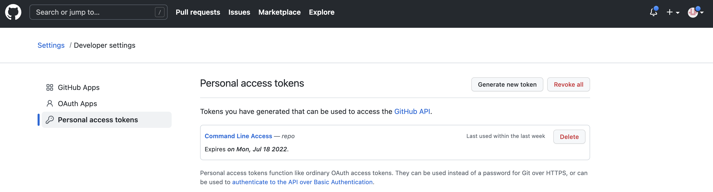
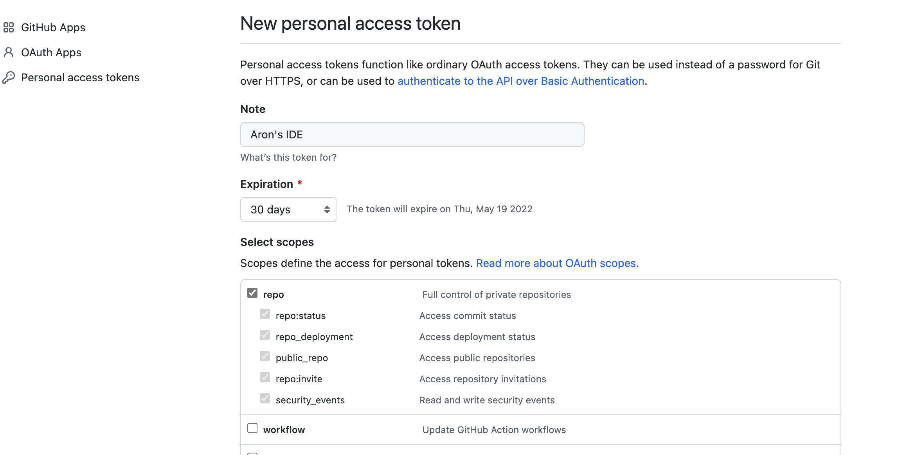
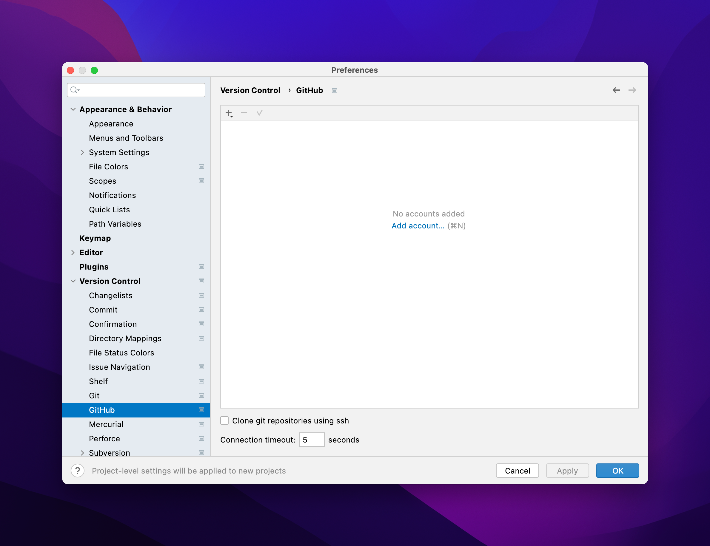
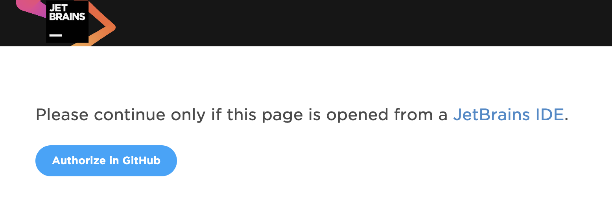
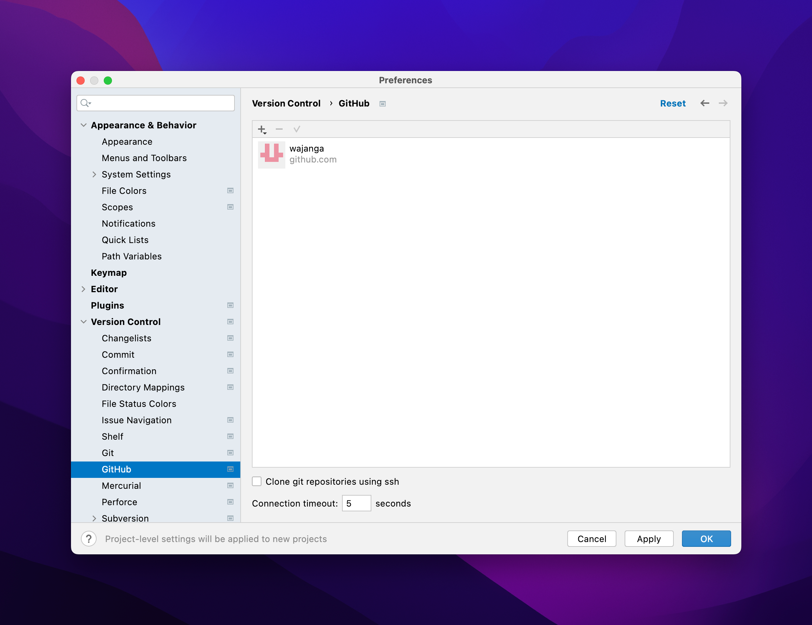
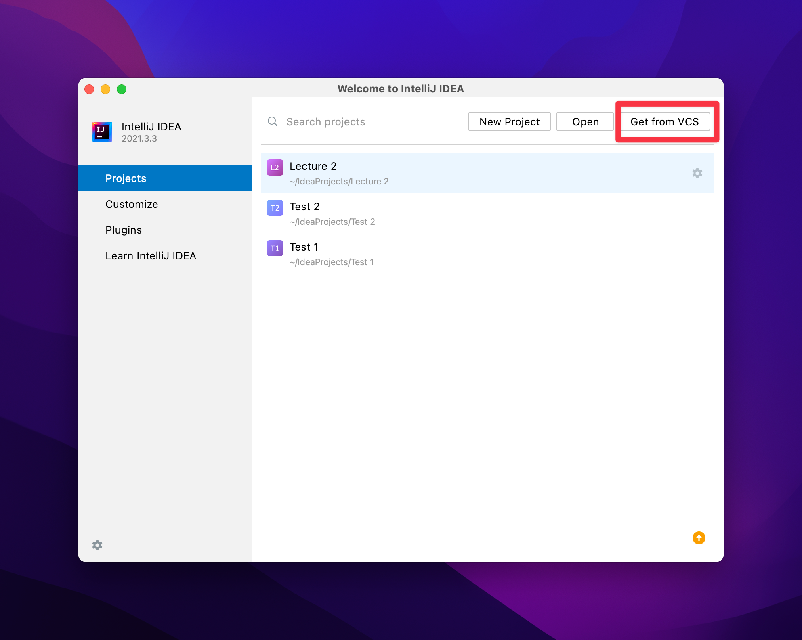
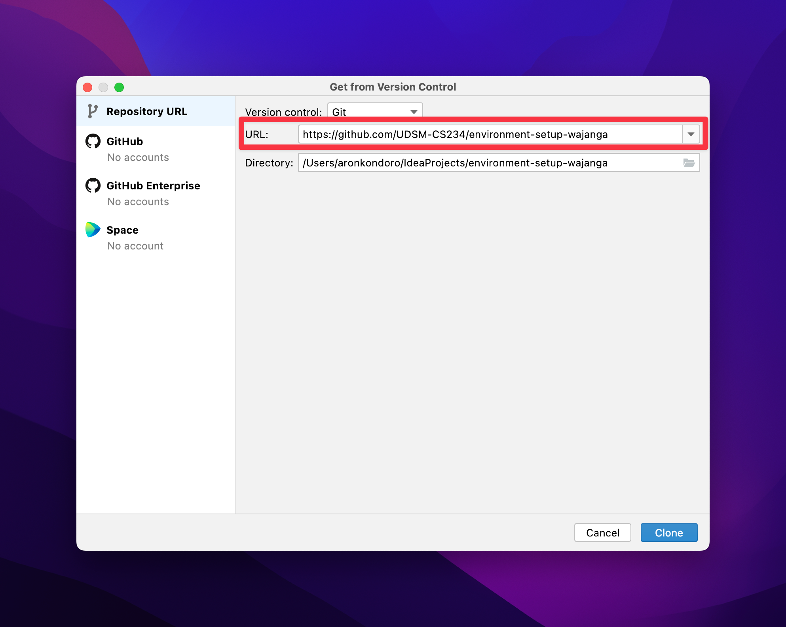

# CS 234 Lab 1: Hello World"

## 1. Preliminaries
**GitHub**. We're using GitHub to manage how all the code goes from us to you and back to us again. That means you'll need to create yourself an account at https://github.com. If you haven't already done so, you need to it now.

**Student Introduction**. We have an introduction form in the LMS to track all of the students in the class. Please fill it out ASAP if you haven't already done so. If you don't fill out the form, we won't be able to give you a grade in the class.

** Moodle LMS**. We will use Moodle LMS to manage all the activities within this course. We will post lab exercises, assignments, and any other practical-related announcements in the LMS. Please, make sure you login regularly.

## 2. Introduction
This lab will focus on making sure you have installed IntelliJ properly, including the necessary libraries and plugins. Our goal is to make sure that we've sorted out all development environment issues. If you have already programmed in Java, you should be good to go. If you are a beginner, don't panic. This exercise will walk you through getting everything installed properly on your computer so, for subsequent assignments, things will go much smoother.

## 3. Install Git
"Git" is a distributed version control system, used to manage code repositories. "GitHub" is a commercial service that hosts Git repositories in the same way that "Gmail" is a commercial service that hosts email. We're not going to teach you all the gory details of how Git works, since there's a lot of complexity that only really happens when you work in teams. Nonetheless, Git is widely used in industrial and open-source software development. You might as well get started.

To get Git installed on your computer, each operating system you might be using has its own quirks for this. You can follow the instruction as described here: https://git-scm.com/book/en/v2/Getting-Started-Installing-Git

## 4. Install Java
You need to install the latest version of the Java Development Kit (JDK). You can get it here: https://www.oracle.com/java/technologies/downloads/. The latest version is Java 18. Oracle has different packages for all platforms including Linux, macOS, and Windows. You can follow the installation instructions for each platform as described here: https://docs.oracle.com/en/java/javase/18/install/overview-jdk-installation.html

## 5. Install IntelliJ
Visit the IntellJ IDEA download site: https://www.jetbrains.com/idea/download/ and download the free "community edition" (CE). Versions are available for Windows, MacOS, and Linux. IntelliJ is an example of an integrated development environment (IDE). The other popular Java IDE you may have heard of or used in the past is Eclipse and NetBeans. For CS 234, you will use IntelliJ. If you run anything else, we won't help you when it breaks, and if you submit something that "works for you" but doesn't work for us, your grade will suffer.

If this is the first time you have installed IntelliJ IDEA on your computer, the software will ask you to customize it a bit before starting. You can pick a color scheme that you like, then it will ask you to customize different plugins. You can skip this for now, and start using the IDE.

If you've previously installed IntelliJ, it's time to upgrade. The latest version as of this writing is "IntelliJ IDEA CE 2022.1" which was released on 12 April 2022. It is important to install the latest version as IntelliJ keeps getting better every year, with new features and bug fixes.

## 6. Getting Started with IntelliJ
If you've previously used IntelliJ and have a project open, you'll see a menu entry, File → New → Project... Otherwise, if you're staring at the "Welcome to IntelliJ IDEA" launch screen, there's a Create New Project button. Click it. Either way, you'll see many different kinds of projects to choose from. In the left column, it should offer you a "Java project" as the default option, and there's a drop-down from the top that should let you select "18" as the Project SDK. If it's only offering you an older version, don't worry, we'll fix that below. Otherwise, you just give it a name ("Hello") and tell IntelliJ where to put the files (typically inside the "IdeaProjects" directory).

If IntelliJ is telling you it has Project SDK: <No SDK> at the top of the window and gives you no other choices, you should hit the New... box. It should automatically find the path to the latest JDK installation. If it doesn't you can manually locate it. On my Windows machine it was located at C:\Program Files\Java\jdk-18.

### Hello, world
At this point, you're ready to write a program that actually does something. We're going to keep this super simple and verify that you can create a Java8 "Hello, world" program.  You should be able to right-click on the left column where it has "src" and create a new Java class. Go ahead and do that with a simple name like "Hello". It should go ahead and make that for you and will fill it out with something hopefully like this:

```
public class Hello {

} 
```

Rewrite that to look like this:

```
public class Hello { 
    public static void main(String[] args) { 
        System.out.println("Hello, world"); 
    } 
} 
```

Right-click on "src/Hello" in the left column, and select "Run Hello.main()".  It should go split-screen on you and you'll see "Hello, world" printed at the bottom. Now for something silly, but it's enough to verify that yo''ve got the latest version of Java working, rather than something older that might be leftover on your computer:

```
import java.util.function.Supplier; 

public class Hello { 
    public static void main(String[] args) { 
        System.out.println("Hello, world"); 

        Supplier<String> x = () −> "Hello, lambda!"; 
        System.out.println(x.get()); 
    } 
}
```

If that worked, then you're running Java. Congratulations!!!

## 7. IntelliJ, Git, and GitHub
We already had you install Git in a previous section. Now you're going to connect it to IntelliJ and use it to copy our reference code from GitHub to your own computer.

### IntelliJ + GitHub
IntelliJ has special support to talk to GitHub, avoiding all the mess of usernames and passwords you'd use for other Git servers. After you log into GitHub's web page, the icon in the upper right
has a Settings selection, and from there you can select the Personal access tokens tab on the left.



At that point, you select the Generate new token button in the upper right, and give the token a name (e.g., "Aron's IDE"). It's important, when GitHub asks you, that you give this token all the "repo" permissions.



After you generate it, your token is displayed as a long string of random digits. Leave this on-screen, then flip over to IntelliJ. You're going to need to tell IntelliJ how to use this token. You do this, one time, and IntelliJ will remember it. Go to your preferences (IntelliJ IDEA →Preferences... on a Mac, File →Preferences... on Windows) and select Version Control →GitHub. You should see this:



Click the "Add account" link. Choose the option to Log In via GitHub. The IDE will switch you to a browser window where you will have to authorize access to your GitHub Account as seen below. Click the Authorize button.



If you're successful, you'll end up looking at something like this:



IntelliJ might also ask you for a "master password" that it uses to encrypt a database of all the different usernames and passwords that you might use with it. You can choose any password you like This password will never leave your laptop.

### Cloning your repository
Every week, we'll give you a new link via the LMS. You'll click on it and GitHub will create a copy of our reference code for you. For this week, the link is https://classroom.github.com/a/X5Qxu_cf

You may see a permission dialog from GitHub, which you should approve. Next, click the button to Accept this assignment and you're ready to make a local copy by "checking out" this code from
GitHub. You'll want to create a new Project by selecting Get from VCS as seen below



You'll use the URL that GitHub created for you. It probably looks something like https://github.com/UDSM-CS234/environment-setup-aronkondoro. Copy-and-paste it into the dialog box, then hit Clone.



*Now that it's all done, you'll have a directory that lives inside IdeaProjects in your home directory. You'll create a separate Git repository every week as part of CS 234. Please make sure they're in separate directories. Don't try to open one on top or inside of another.*

### Make sure it's working
If everything is working, you should be able to scroll through the "Project" tab on the left, into the src directory, navigate to the Main.java file. Select it and run. Everything should compile. If so, then you're almost done. If you get compiler errors, then you need to back up and revisit the steps above to get Java configured properly. (Or, if you have problems, ask for help.)

## 8. Do the Lab Assignment
For this week, there is a simple assignment.

Modify the example program to compute the position of an object after falling for 10 seconds, outputting the position in meters. The formula in Math notation is: 
x(t) = 0.5 × at<sup>2</sup> + v<sub>i</sub>t + x<sub>i</sub>

| Variable        | Meaning     | Value |
| --------------- | ----------- | ----- |
| a               | Acceleration (m/s<sup>2</sup>)|-9.81|
| t               | Time (s)    |10     |
| v<sub>i</sub>   | Initial velocity (m/s)|0|
| x<sub>i</sub>   | Initial position        |0|

*Note*: The correct value is -490.5 m. Java will output more digits after the decimal place, but that is unimportant.

This file at the very top-level of repository is called README.md. Right now, it contains these instructions. You can edit it to include your name and registration number. In future weeks, we'll have other questions for you here as well.

A quick warning: GitHub has a bunch of features that you should absolutely not use. Notably, you can directly edit files on the web in GitHub. Don't use GitHub's editing features. We're trying to ensure that you make all your changes in IntelliJ, so you never have to worry about merge conflicts and other problems that can happen when you're editing in more than one placed at a time.